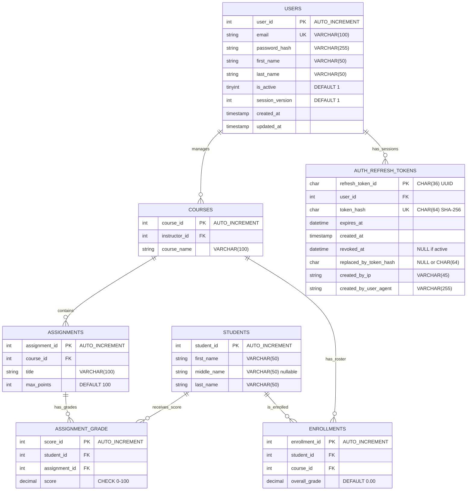

# ERD

```mermaid

erDiagram
    USERS ||--o{ COURSES : "manages"
    USERS ||--o{ AUTH_REFRESH_TOKENS : "has_sessions"
    COURSES ||--o{ ASSIGNMENTS : "contains"
    COURSES ||--o{ ENROLLMENTS : "has_roster"
    STUDENTS ||--o{ ENROLLMENTS : "is_enrolled"
    STUDENTS ||--o{ ASSIGNMENT_GRADE : "receives_score"
    ASSIGNMENTS ||--o{ ASSIGNMENT_GRADE : "has_grades"

    USERS {
        int user_id PK "AUTO_INCREMENT"
        string email UK "VARCHAR(100)"
        string password_hash "VARCHAR(255)"
        string first_name "VARCHAR(50)"
        string last_name "VARCHAR(50)"
        tinyint is_active "DEFAULT 1"
        int session_version "DEFAULT 1"
        timestamp created_at
        timestamp updated_at
    }

    AUTH_REFRESH_TOKENS {
        char refresh_token_id PK "CHAR(36) UUID"
        int user_id FK
        char token_hash UK "CHAR(64) SHA-256"
        datetime expires_at
        timestamp created_at
        datetime revoked_at "NULL if active"
        char replaced_by_token_hash "NULL or CHAR(64)"
        string created_by_ip "VARCHAR(45)"
        string created_by_user_agent "VARCHAR(255)"
    }

    STUDENTS {
        int student_id PK "AUTO_INCREMENT"
        string first_name "VARCHAR(50)"
        string middle_name "VARCHAR(50) nullable"
        string last_name "VARCHAR(50)"
    }

    COURSES {
        int course_id PK "AUTO_INCREMENT"
        int instructor_id FK
        string course_name "VARCHAR(100)"
    }

    ASSIGNMENTS {
        int assignment_id PK "AUTO_INCREMENT"
        int course_id FK
        string title "VARCHAR(100)"
        int max_points "DEFAULT 100"
    }

    ENROLLMENTS {
        int enrollment_id PK "AUTO_INCREMENT"
        int student_id FK
        int course_id FK
        decimal overall_grade "DEFAULT 0.00"
    }

    ASSIGNMENT_GRADE {
        int score_id PK "AUTO_INCREMENT"
        int student_id FK
        int assignment_id FK
        decimal score "CHECK 0-100"
    }

```