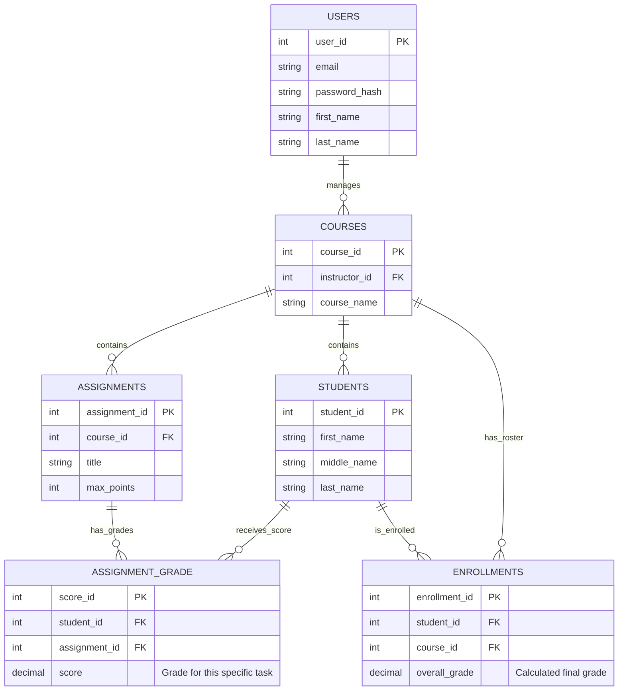

# ERD

```mermaid

erDiagram
    USERS ||--o{ COURSES : "manages"
    COURSES ||--o{ ASSIGNMENTS : "contains"
    COURSES ||--o{ STUDENTS : "contains"
    COURSES ||--o{ ENROLLMENTS : "has_roster"
    STUDENTS ||--o{ ENROLLMENTS : "is_enrolled"
    STUDENTS ||--o{ ASSIGNMENT_GRADE : "receives_score"
    ASSIGNMENTS ||--o{ ASSIGNMENT_GRADE : "has_grades"

    USERS {
        int user_id PK
        string email
        string password_hash
        string first_name
        string last_name
    }

    COURSES {
        int course_id PK
        int instructor_id FK
        string course_name
    }

    ASSIGNMENTS {
        int assignment_id PK
        int course_id FK
        string title
        int max_points
    }

    STUDENTS {
        int student_id PK
        string first_name
        string middle_name
        string last_name
    }

    ENROLLMENTS {
        int enrollment_id PK
        int student_id FK
        int course_id FK
        decimal overall_grade "Calculated final grade"
    }

    ASSIGNMENT_GRADE {
        int score_id PK
        int student_id FK
        int assignment_id FK
        decimal score "Grade for this specific task"
    }

```